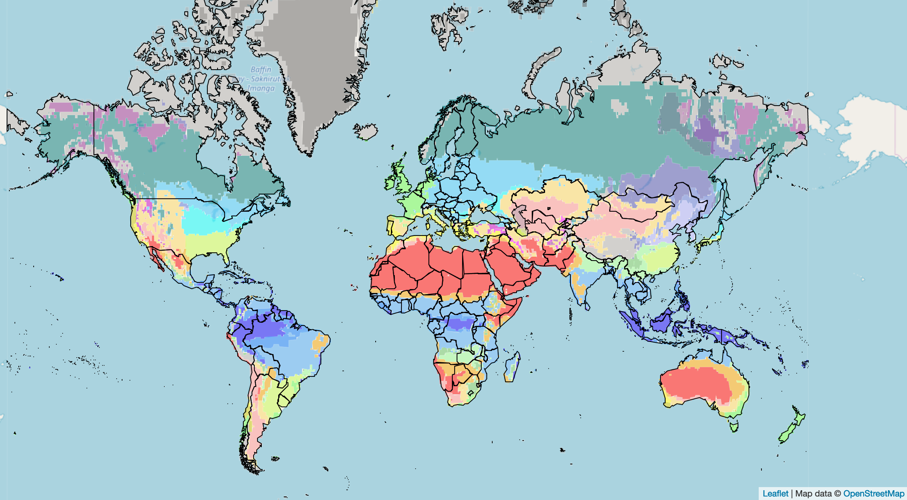
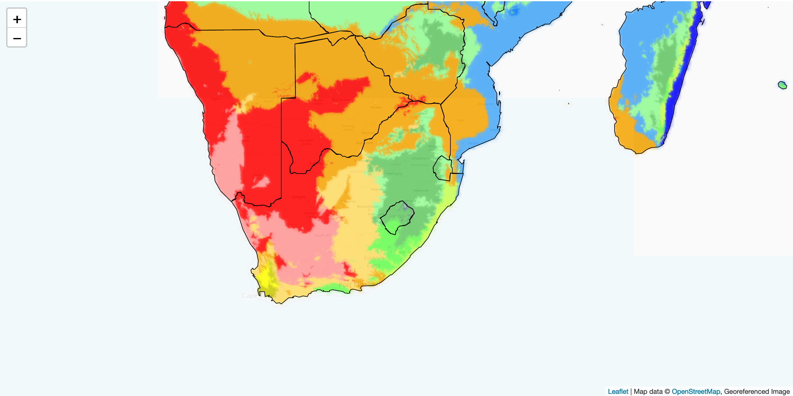

# Interactive Köppen-Geiger Climate Classification Map
An interactive koppen climate map for 3 different scales. Work in Progress

## Zoom 2:

## Zoom 3:

Data Source:
Beck, Hylke E.; E. Zimmermann, Niklaus; McVicar, Tim R.; Vergopolan, Noemi; Berg, Alexis; Wood, Eric F. (2018): Present and future Köppen-Geiger climate classification maps at 1-km resolution. figshare. Fileset.

Methodology:
### 1. Make tiles using:
* gdal_translate gdal_translate -of vrt -expand rgba Beck_KG_V1_present_0p083.tif <tileLayer>.vrt
* gdal2tiles.py <tileLayer>.vrt
#### refs: https://gis.stackexchange.com/questions/286649/displaying-tiles-generated-by-gdal2tiles-with-openlayers
stretch tileLayers in Leaflet: https://stackoverflow.com/questions/18687120/leaflet-zoom-in-further-and-stretch-tiles

## ToDo:
* fix map bounds
* fix zoom to country
* fix highlight when zoomed in
* fix France, New Zealand, Netherlands etc.
* in info -> add % each climate type and then drop-down for future as well
